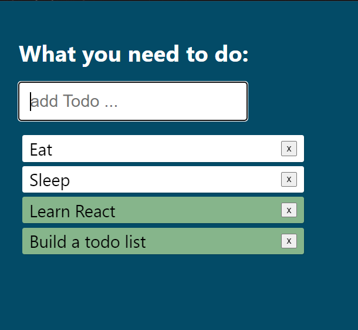

# todo-list

## Description

This is a small React app displaying an interactive todo list.

Type items and enter to add them.

Click on an item to mark it as checked and turn it green.

Click on the x to remove an item.

## How to Run

This project was created using Create React App.

Check it out on a <a href='https://codesandbox.io/s/github/waleedalrawi/todo-list'>sandbox here!</a>

To run locally, download the repository, navigate to it in your terminal, and run:

### `npm start`

which runs the app in the development mode.

Open [http://localhost:3000](http://localhost:3000) to view it in your browser.

## Roadmap of Future Improvements

Add more styling.

## License

MIT license - see license file.
